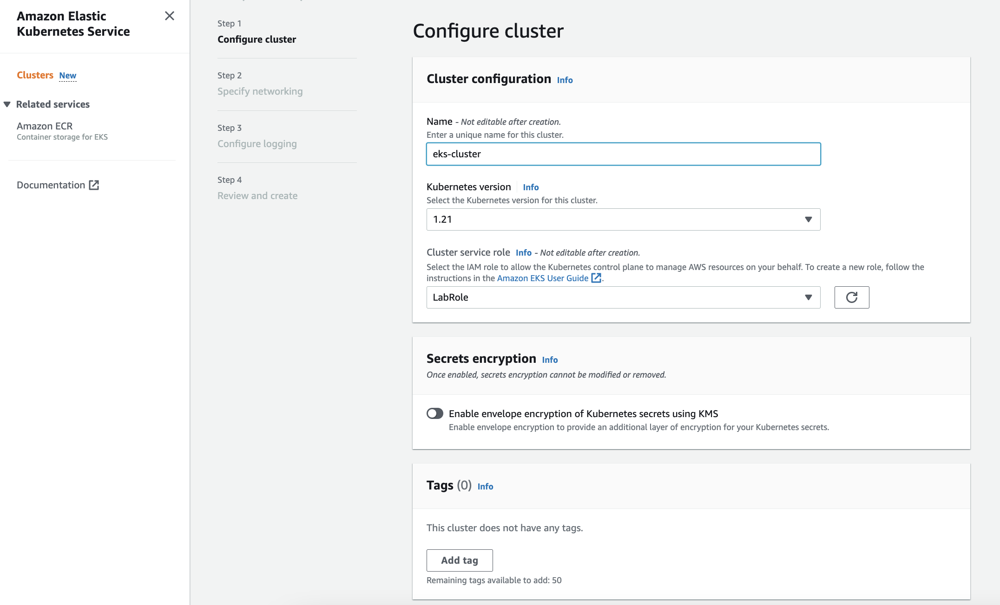

## Kubernetes - Parte 1

### Instalar cliente kubectl


```bash
#Descargar el cliente:
curl -LO "https://dl.k8s.io/release/$(curl -L -s https://dl.k8s.io/release/stable.txt)/bin/linux/amd64/kubectl"

#Instalar el cliente
sudo install -o root -g root -m 0755 kubectl /usr/local/bin/kubectl

#Validar instalación
kubectl version --client
```
La salida debería ser similar a la siguiente:

```bash
[ec2-user@ip-172-31-86-195 ~]$ kubectl version --client
WARNING: This version information is deprecated and will be replaced with the output from kubectl version --short.  Use --output=yaml|json to get the full version.
Client Version: version.Info{Major:"1", Minor:"24", GitVersion:"v1.24.1", GitCommit:"3ddd0f45aa91e2f30c70734b175631bec5b5825a", GitTreeState:"clean", BuildDate:"2022-05-24T12:26:19Z", GoVersion:"go1.18.2", Compiler:"gc", Platform:"linux/amd64"}
Kustomize Version: v4.5.4
```

### Desplegar un cluster de EKS

Buscamos el servicio EKS.


Agregamos un cluster


Le asignamos un nombre, versión y Role a usar. En este caso ***LabRole*** es el configurado para Academy.



Para el networking debemos de seleccionar las ***Subnets*** a las cuales queremos presentar, ***Security Groups*** y si el cluster será público, privado o ambos.


Podemos configurar el registro de logs del ***Control Plane*** para consultarlo en Cloudwatch. Dejamos desactivado porque el Role no tiene permisos para escribir en ese servicio.


La creación del cluster puede demorar algunos minutos. Luego deberiamos de poder consultar datos del mismo en la sección ***"Clusters"***


### Conectarnos a nuestro cluster

Teniendo la consola de AWS configurada, podemos ejecutar el siguiente comando:

`aws eks --region us-east-1 update-kubeconfig --name nombre_del_cluster`

Deberiamos de ver algo asi 

```bash
$ kubectl version 
Client Version: version.Info{Major:"1", Minor:"19", GitVersion:"v1.19.3", GitCommit:"1e11e4a2108024935ecfcb2912226cedeafd99df", GitTreeState:"clean", BuildDate:"2020-10-14T18:49:28Z", GoVersion:"go1.15.2", Compiler:"gc", Platform:"darwin/amd64"}
Server Version: version.Info{Major:"1", Minor:"21+", GitVersion:"v1.21.9-eks-14c7a48", GitCommit:"717bfb2b8ceb809a42a6c0baabde59fae28637ef", GitTreeState:"clean", BuildDate:"2022-04-01T03:17:28Z", GoVersion:"go1.16.12", Compiler:"gc", Platform:"linux/amd64"}
```
