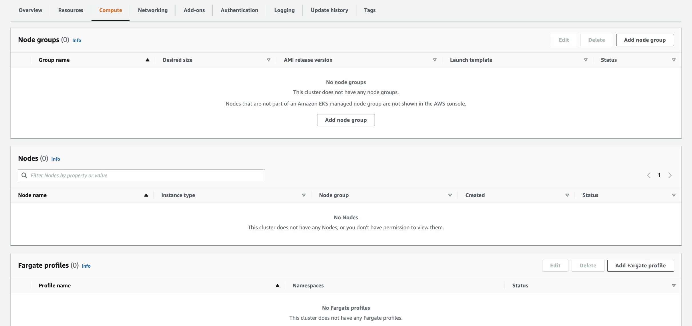
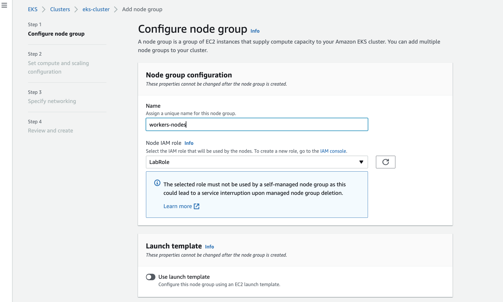
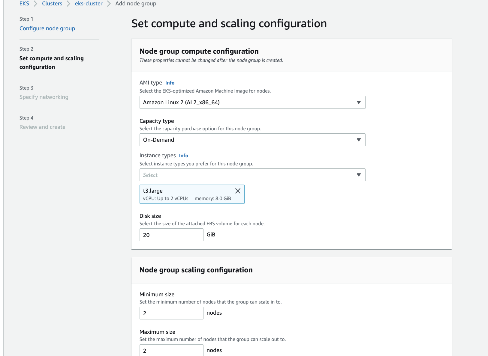
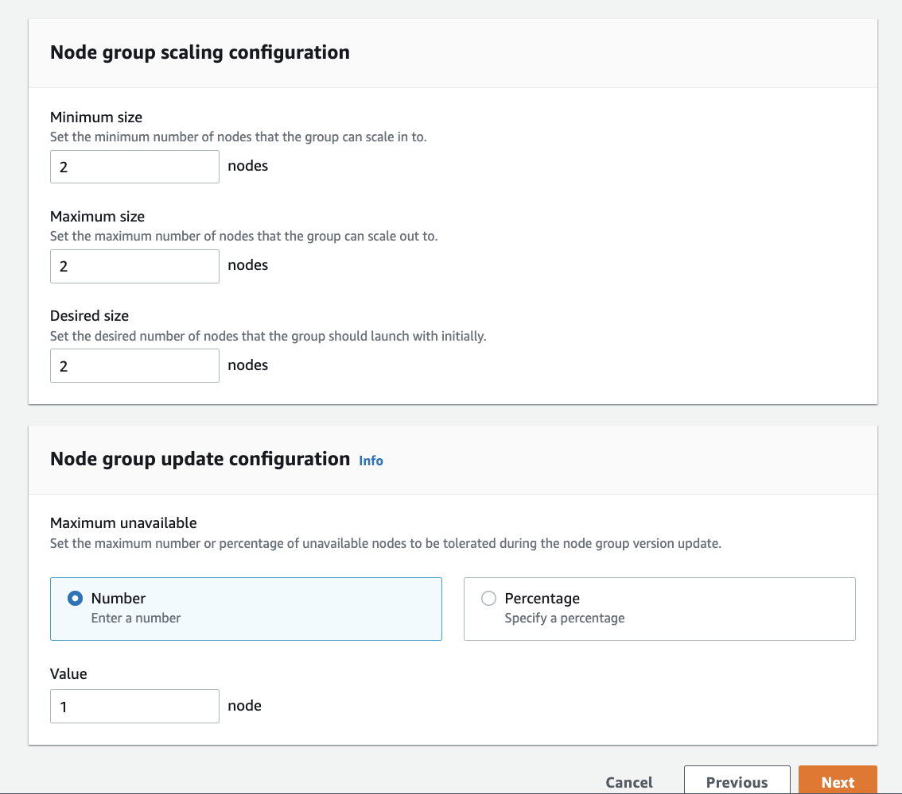
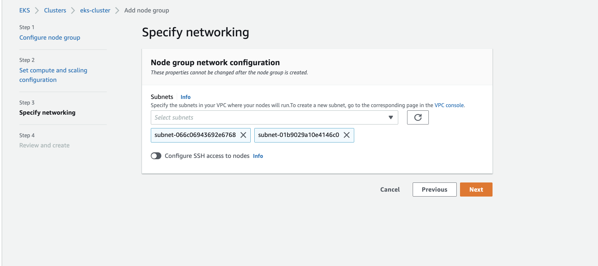
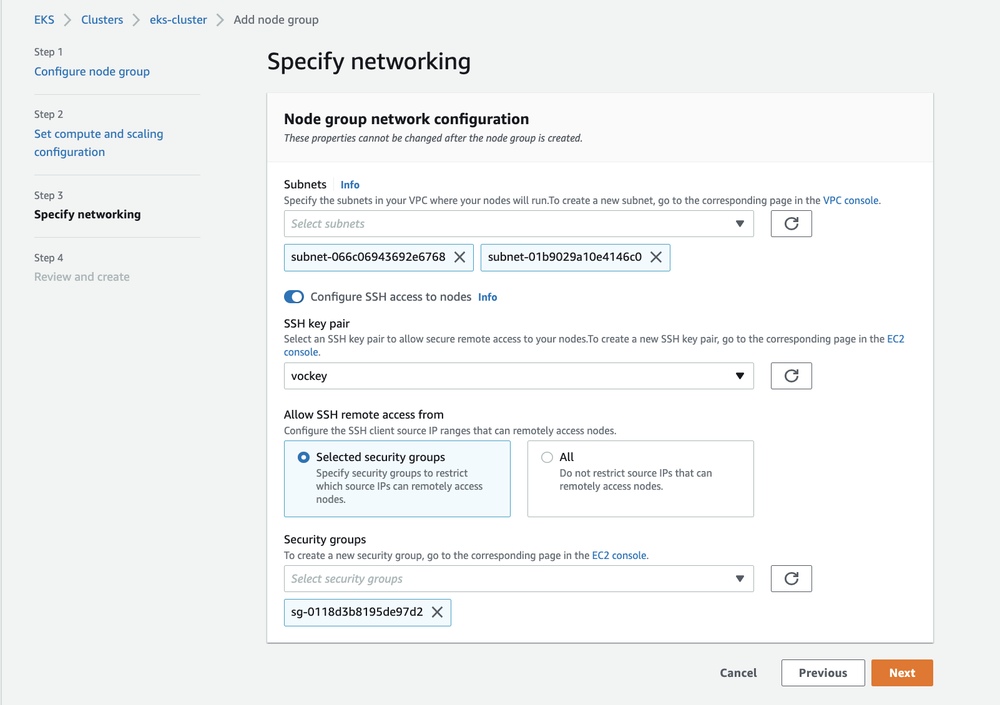
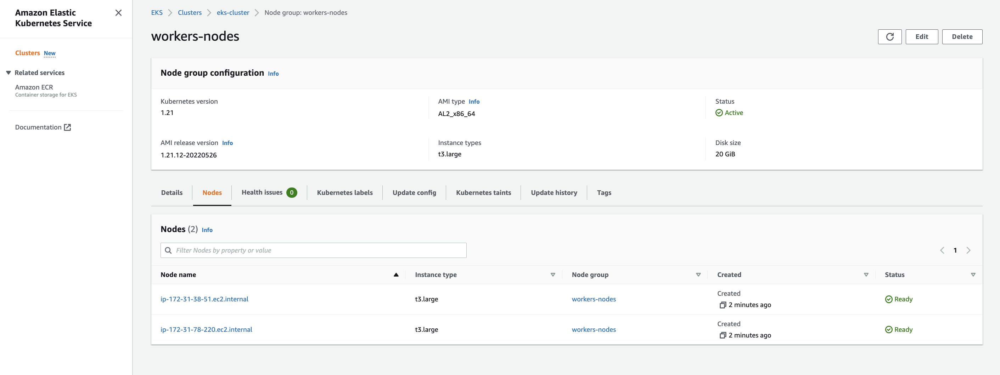

## Kubernetes - Parte 2

### Creando un worker Group

Vamos a desplegar un ***Worker Group***, es decir, un grupo de nodos workers donde desplegaremos nuestras cargas de trabajo. Tal como en el servicio ***AWS ECS***, podemos desplegar containers sobre instancias EC2 o sobre el servicio ***Serverless*** conocido como ***Fargate***.  
Por restricciones de la cuenta de Academy, vamos a utilizar instancias EC2. 

Vamos al tab "Compute" y apretamos "Add node group"



Elegimos el nombre y el role ***LabRole***



Seleccionamos el tipo de reserva ***On-demand***, la AMI de Amazon Linux y el ***Instance Type***



Especficamos los parámetros para el ***Auto-scaling group*** con la cantidad de instancias a desplegar.



Especificamos las ***Subnets*** a presentar. Hacer check donde dice ***"Configure SSH Access..."***, de esta forma tenemos acceso SSH a las instancias de EC2 que usamos como workers.



Seleccionamos ***Keypair*** y ***Security Group*** que nos permita acceder por SSH.



Esperamos que despliegue los nodos y que el estado del ***Worker Group*** sea ***"Active"***.




Luego podemos loguearnos en el cluster usando la consola de AWS y el comando: `aws eks --region us-east-1 update-kubeconfig --name eks-cluster`

Si hacemos un `kubectl get nodes` deberíamos de ver los nodos desplegados.

```bash
$ kubectl get nodes
NAME                            STATUS   ROLES    AGE     VERSION
ip-172-31-38-51.ec2.internal    Ready    <none>   3m42s   v1.21.12-eks-5308cf7
ip-172-31-78-220.ec2.internal   Ready    <none>   3m22s   v1.21.12-eks-5308cf7
```
